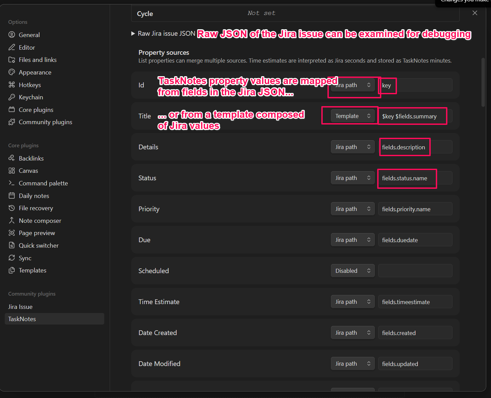
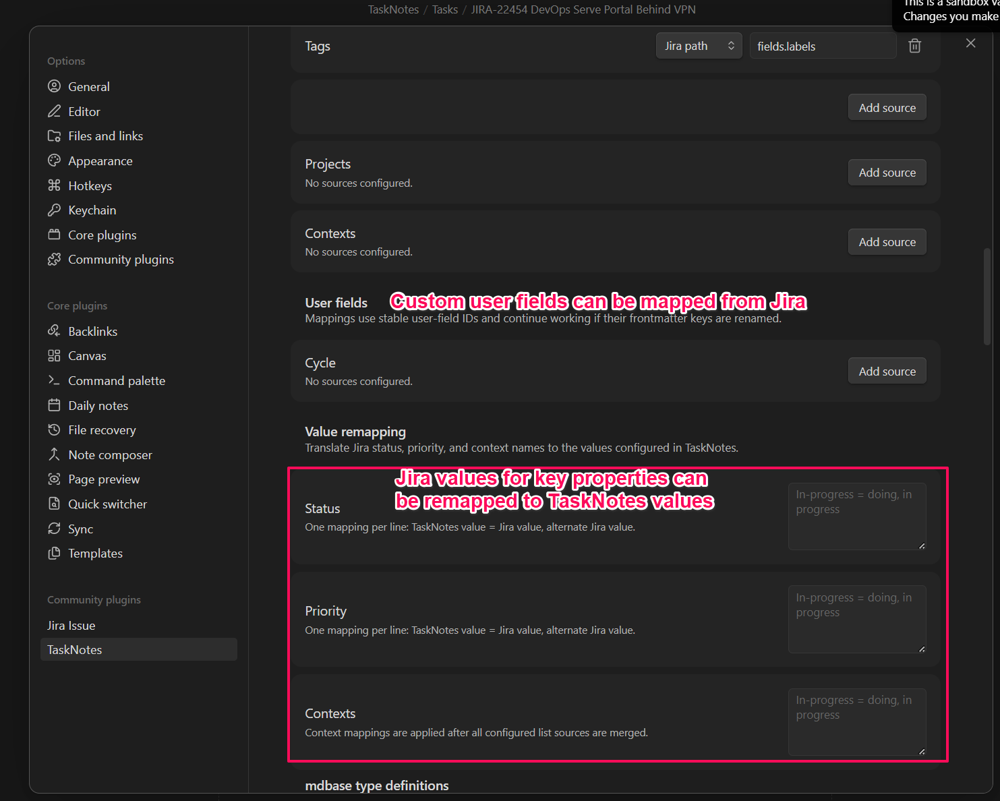
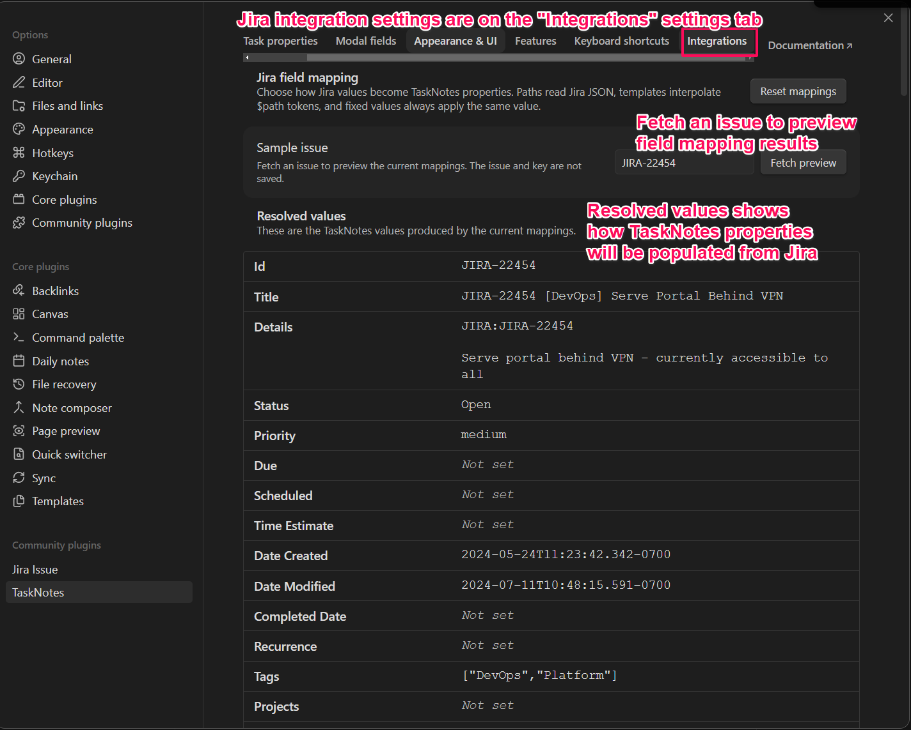
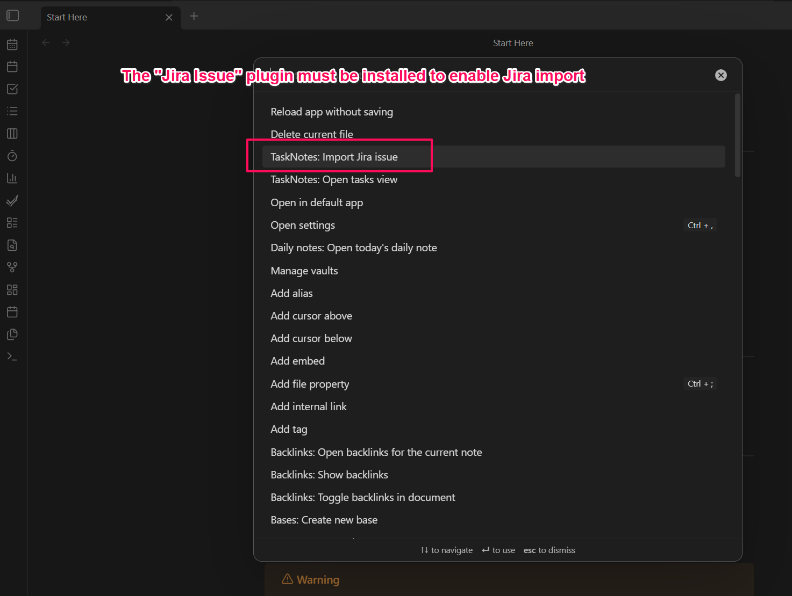
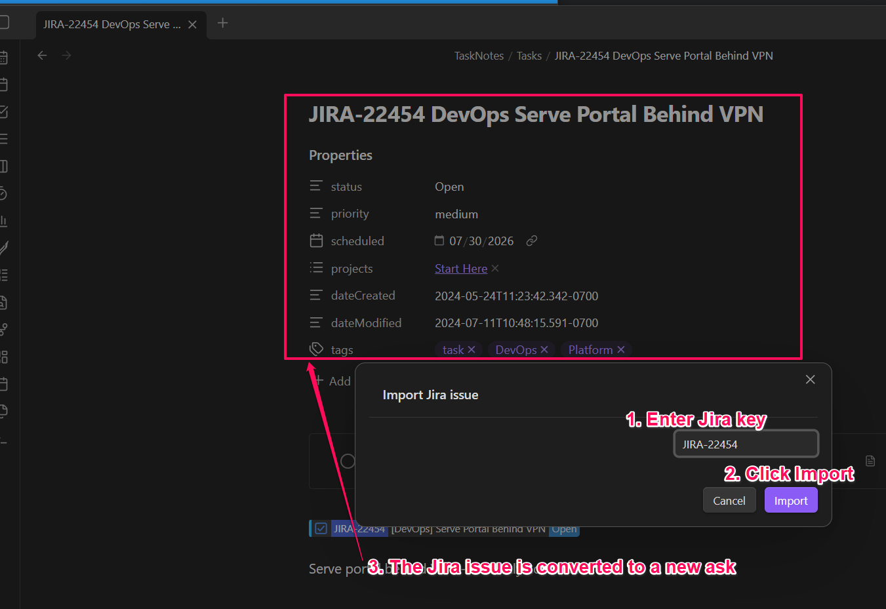

# TaskNotes for Jira

TaskNotes Jira is an Obsidian companion plugin that imports Jira issues as TaskNotes tasks. It connects the Jira data supplied by the Jira Issue plugin to TaskNotes’ task-creation API, with configurable field mapping, import previews, and Jira backlinks.

## Requirements

TaskNotes Jira depends on two other Obsidian plugins:

- **TaskNotes** [`tasknotes`](https://community.obsidian.md/plugins/tasknotes) creates and manages the imported task notes.
- **Jira Issue** [`obsidian-jira-issue`](https://community.obsidian.md/plugins/obsidian-jira-issue) connects to Jira and retrieves issue data.

Install, enable, and configure both dependencies before using TaskNotes Jira. In particular, verify that Jira Issue can load an issue from your Jira account and that TaskNotes can create a normal task.

## Features

- Import a Jira issue by key from the Obsidian command palette.
- Map Jira JSON paths, templates, fixed values, and disabled sources to TaskNotes properties.
- Merge multiple Jira sources into list-valued TaskNotes properties.
- Remap Jira status, priority, and context values.
- Map Jira data into TaskNotes user-defined fields.
- Fetch a sample issue and preview the values produced by the current mapping.
- Inspect, resize, and copy a sample issue’s raw JSON without persisting it.
- Add a `JIRA:PROJ-1234` backlink to the imported task while preserving the mapped description.
- Use TaskNotes’ existing creation defaults, templates, and safe filename generation.
- Optionally use the active note as the project when the Jira mapping does not explicitly supply one.

## Usage

After the dependencies are configured:

1. Open **Settings → TaskNotes Jira** and configure the Jira-to-TaskNotes field mappings.


2. Optionally fetch a sample issue to verify the resolved values.

3. Run **Import Jira issue as task** from the command palette.

4. Enter an issue key such as `PROJ-1234`.


The companion plugin retrieves the issue through Jira Issue and submits the mapped task through TaskNotes’ public API. TaskNotes remains responsible for applying task defaults, generating a safe filename, writing the note, and updating its cache.

## Privacy and security

TaskNotes Jira does not implement Jira authentication and should not store Jira credentials. Jira requests and account configuration are delegated to Jira Issue. Sample issue data is held only in memory for the settings preview and is not saved in this plugin’s settings.

Jira issues can contain sensitive project information. Review raw JSON before copying or sharing it, and protect your Obsidian vault and plugin data accordingly. This plugin does not include telemetry.

## Compatibility

This plugin requires the TaskNotes runtime API v1 with the `tasks.write` capability and the Jira Issue `api.base.getIssue` API. It detects missing or incompatible dependencies at runtime and reports actionable notices.

## Troubleshooting

- **The import command reports that Jira Issue is unavailable:** Enable Jira Issue and confirm that its Jira account is configured.
- **The import command reports that TaskNotes is unavailable:** Enable TaskNotes and confirm that it can create a task normally.
- **A mapping produces no value:** Load the issue in the mapping preview and compare the configured path with the raw JSON.

## Development
To install from source:

1. Install and configure TaskNotes and Jira Issue.
2. Download or build `main.js`, `manifest.json`, and `styles.css` for TaskNotes Jira.
3. Place the files in `<vault>/.obsidian/plugins/tasknotes-jira/`.
4. Reload Obsidian.
5. Enable **TaskNotes Jira** under **Settings → Community plugins**.

```bash
npm install
npm run dev
```

Run `npm run build` for a production bundle and `npm run lint` before submitting changes. The required Obsidian release artifacts are `main.js`, `manifest.json`, and `styles.css`.

Because this repository already lives inside an Obsidian vault, `npm run build` makes the current sandbox installation ready to reload. To deploy the same artifacts to a separate test vault, run `npm run build:test`. Its destination defaults to the sibling TaskNotes E2E vault and can be overridden with `OBSIDIAN_PLUGIN_PATH` or a git-ignored `.copy-files.local` file containing one destination plugin directory per line.

### Releases

Add user-facing changes to `docs/releases/unreleased.md`, then prepare a release with npm's version command:

```bash
npm version patch
git push --follow-tags
```

Use `minor`, `major`, or an explicit semantic version instead of `patch` when appropriate. The version lifecycle synchronizes `manifest.json` and `versions.json`, promotes the unreleased notes to `docs/releases/<version>.md`, regenerates the release index, commits the changes, and creates the version tag. Pushing the tag triggers GitHub Actions, which builds the plugin and creates a draft GitHub release using that Markdown file. Review and publish the draft in GitHub.

`npm run version` only invokes the lifecycle script directly and does not create npm's version commit or Git tag; use `npm version ...` for releases.

## License

See [LICENSE](LICENSE).
